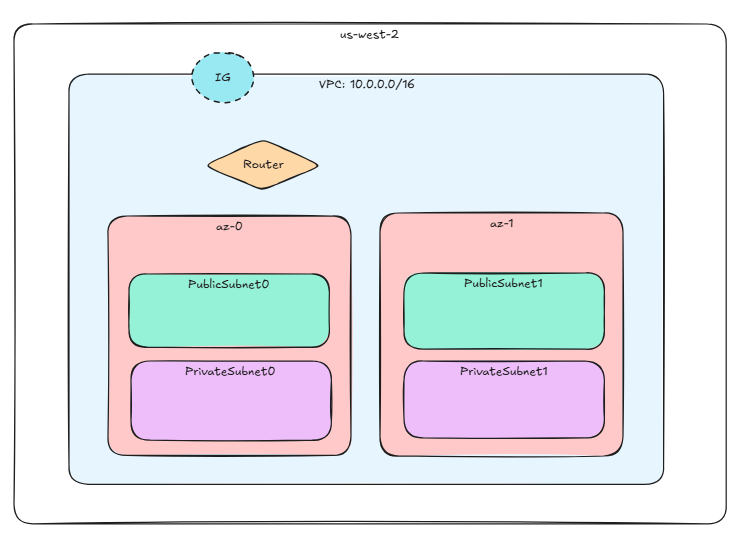
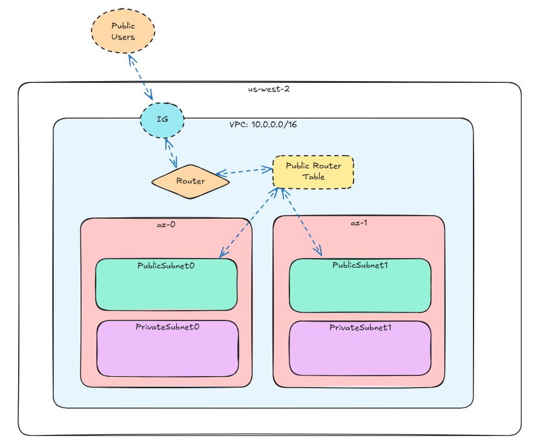
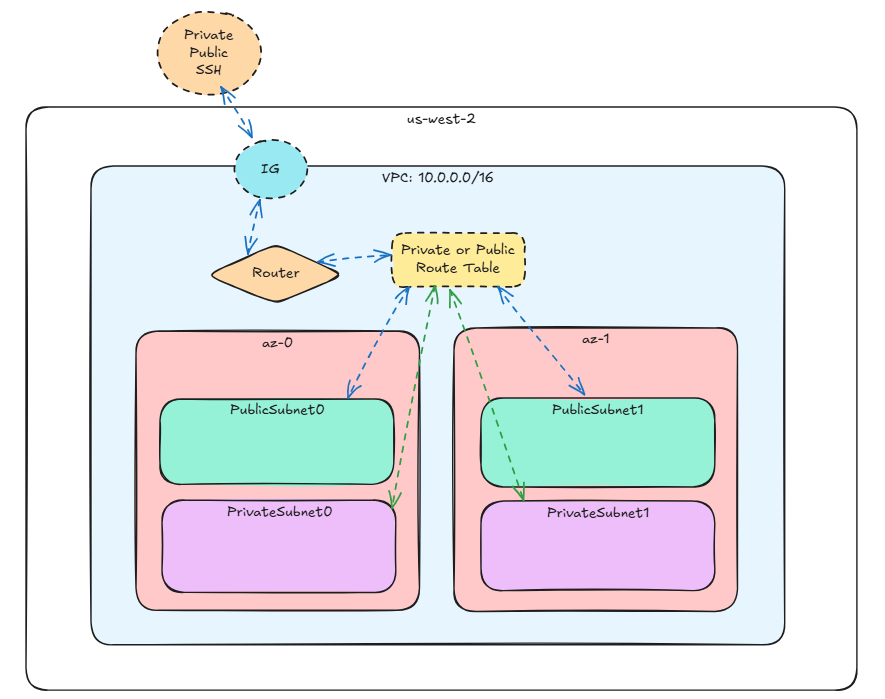

# aws-cloudformation project

## Pre-Reqs
* aws cli installed
* IAM user and aws keys as env variables: 
  * AWS_ACCESS_KEY / AWS_SECRET_ACCESS_KEY

## References
1. [github aws templates](https://github.com/aws-cloudformation/aws-cloudformation-templates)
2. [aws cloudformation docs](https://docs.aws.amazon.com/AWSCloudFormation/latest/UserGuide/Welcome.html)

## Infrastructure
### Diagram

### Traffic

### Description
1. VPC: highly available VPC infrastructure
  - A single VPC is created with DNS support and hostnames enabled.
  - CIDR block: 10.0.0.0/16 (defined in the SubnetConfig mapping).
2. Subnets:
  - Public Subnets: Two public subnets (10.0.0.0/24 and 10.0.1.0/24) in different availability zones.
  - Private Subnets: Two private subnets (10.0.2.0/24 and 10.0.3.0/24) in different availability zones.
3. Internet Gateway:
  - An Internet Gateway is attached to the VPC for public internet access.
4. NAT Gateways:
  - Two NAT Gateways (one in each public subnet) allow private subnets to access the internet securely.
5. Route Tables:
  - Public Route Table: Routes traffic to the Internet Gateway for public subnets.
  - Private Route Tables: Separate route tables for each private subnet, routing traffic through the NAT Gateways.
6. Network ACLs:
  - A public Network ACL is associated with the public subnets, allowing all inbound and outbound traffic.
7. Elastic IPs:
  - Two Elastic IPs are allocated for the NAT Gateways.

